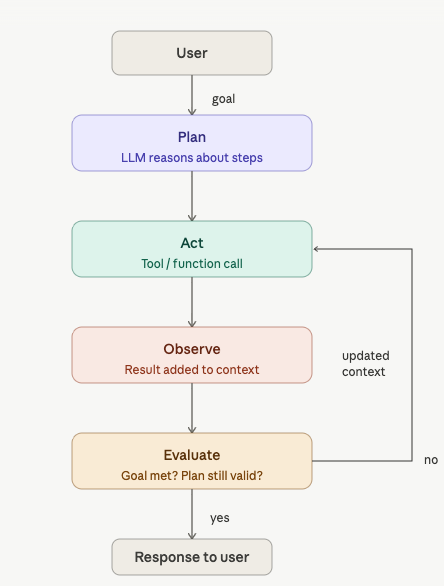
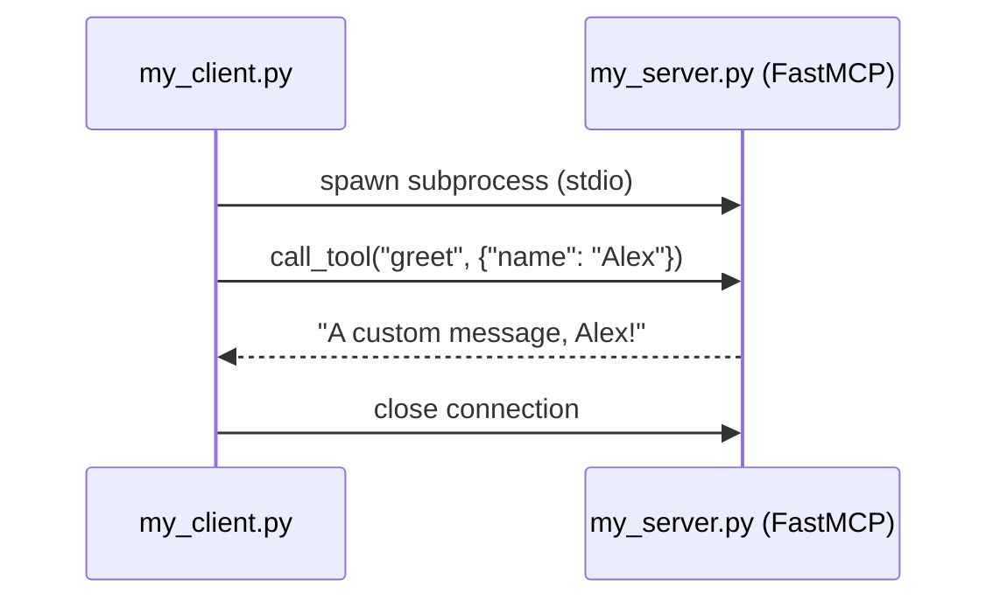
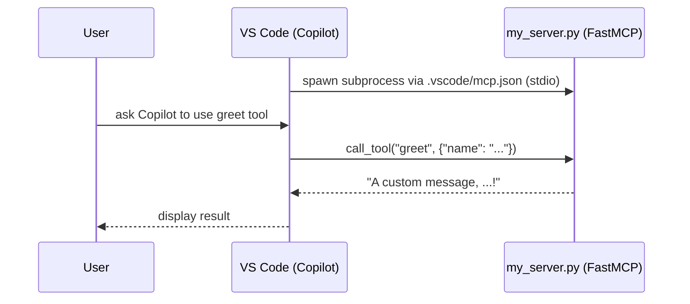

### Interacting with Claude Chat

What is a good prompt?

* Setting the stage: your role, objective and context.
* Define the task: What actions you want Claude to take; build, analyze, debug, write
* Specify the rules: style or tone for Claude to use.

⚠️ The first prompt rarely produces a perfect result. For high-stakes work ask Claude to cite sources (and enable web-search tool)

What is the fundamental limitation of language models that necessitates the use of coding assistants like Claude Code?

```text
LLM can only process text input/output and cannot directly interact with external systems.
```

### [Claude code in action](https://anthropic.skilljar.com/claude-code-in-action)

Claude code a coding assistant: is essentially a sophisticated **API client** that orchestrates the conversation between **you, the LLM, and your codebase**.

The "magic" is that Claude Code sets up the LLM with the right system **prompts, tools, and workspace context** so Claude can autonomously navigate your codebase, make edits, run tests, and iterate - all while having a conversation with you about what it's doing.


📔 To see all the tool names to which Claude has access, just ask: `List out the names of all the tools you have access to, bullet point list`

When starting in a new codebase run `/init` command. This tells Claude to analyze your entire codebase and understand: the project's purpose and architecture, coding patterns, and structure.

Claude's scopes aka memory layers, Claude reads them at the start of **every session**, [MRO for Claude md files](https://code.claude.com/docs/en/memory#how-claude-md-files-load):

    CLAUDE.md or .claude/CLAUDE.md - Generated with /init, committed to source control, in the root of the project, shared with other engineers.

    CLAUDE.local.md - Lives next to your project's CLAUDE.md in the repo root Git-ignored (auto-added to .gitignore), so it never gets committed. Use it for things only relevant to you on that project: your local dev URLs, personal sandbox credentials, preferred test data, debugging shortcuts, or workflow quirks your teammates don't need.

    ~/.claude/CLAUDE.md - (global, personal) Used with all projects on your machine, it contains instructions that you want Claude to follow on all projects. Communication preferences (e.g. "be concise, skip pleasantries")

In a typical solo project you'd have 2 files loaded upfront (global + project root).


* A **session** is the conversation/interaction lifetime (it starts when you run claude and ends when you exit) 

* A **context window** represents the memory available within a session (it's a fixed token budget), and it fills up as your session progresses.


* Agentic loop: the local agent (  a local app that orchestrates the interaction with the model) keeps looping (`build context → model thinks → execute tool → repeat`) until the model stops returning tool calls and returns plain text instead. That's the exit signal.



📔  Before you type anything: `CLAUDE.md, auto memory, MCP tool names, and skill descriptions` all load into context. The `CLAUDE.md files` and `system prompt` are the static part loaded upfront, everything else acumulates as the session progresses. 

The full context window in a Claude Code session contains:

    System context — git status, current branch, last 5 commits
    Memory files — all your CLAUDE.md files concatenated
    Auto memory — learnings Claude has saved across past sessions (MEMORY.md)
    System prompt — Claude Code's own internal instructions
    Conversation history — all messages back and forth in the current session
    File contents — any files Claude has read during the session
    Tool outputs — results from shell commands, test runs, searches, etc.

* [Exploring the context window](https://code.claude.com/docs/en/context-window) .A bloated `CLAUDE.md` is DEAD WEIGHT ON EVERY SESSION. The general recommendation is to `keep it under 200 lines`. For anything that doesn't apply to every request, you can use Skills or reference files instead — those only get loaded when needed, saving tokens.

Run `/memory` inside your Claude Code session. It shows you which memory files are currently loaded, lets you edit them directly, and reloads the context when you save. Agent Factory

Run run `/context` to see a full breakdown of what's consuming your context window, which will include the `CLAUDE.md` content.

* **MCP** is a open-source standard that follows a client-server architecture, where an MCP host (the app running the agents i.e. Claude Code, VS Code) starts, manages, and owns the client connections to MCP Servers.


Built-in commands (slash commands) are shortcuts that trigger specific workflows or prompts in Claude Code.

Most usefull built-in commands, entire list available [here](https://code.claude.com/docs/en/commands):

```bash
/plugin	# Manage Claude Code plugins
/reload-plugins # Reload all active plugins

/init   # Initialize project with a CLAUDE.md
/memory # Edit CLAUDE.md memory files, enable or disable auto-memory, and view auto-memory entries

/model # swtich between models

/plan [description of task] # enter directly in plan mode : /plan fix the auth bug
```

Create you custom commands aka *skills* to trigger specific workflows or project-specific automation.

Skills are single-purpose instruction that lives in the `.claude/skills` directory of your project. Basically, a skill is just a `SKILL.md` file with two parts :

- YAML frontmatter (between `---` markers) that tells Claude when to use the skill

- Markdown content with instructions that Claude should follow when the skill is invoked.

Skill `/explain-code` example:

```yaml
---
name: explain-code
description: Explains code with visual diagrams and analogies. Use when explaining how code works, teaching about a codebase, or when the user asks "how does this work?"
---

When explaining code, always include:

1. **Start with an analogy**: Compare the code to something from everyday life
2. **Draw a diagram**: Use ASCII art to show the flow, structure, or relationships
3. **Walk through the code**: Explain step-by-step what happens
4. **Highlight a gotcha**: What's a common mistake or misconception?

Keep explanations conversational. For complex concepts, use multiple analogies.
```

* Plan MODE vs Thinking KEYWORD primary difference?
Plan mode handles breadth (multi-step tasks) while thinking handles handles depth (complex single tasks).

Enable plan mode (workflow control): Claude will outline steps before acting

Use thinking (internal reasoning): keyword that increase the internal reasoning budged. There's actually a spectrum: 
```bash
"Think".         Basic reasoning
"Think more"     Extended reasoning
"Think a lot"    Comprehensive reasoning
"Think longer"   Extended time reasoning
"Ultrathink"     Maximum reasoning capability
```

### Introduction to Model Context Protocol

* MCP server with one tool called `greet`: setup without MCP host vs setpup with MCP host (Claude Code, VS Code)




