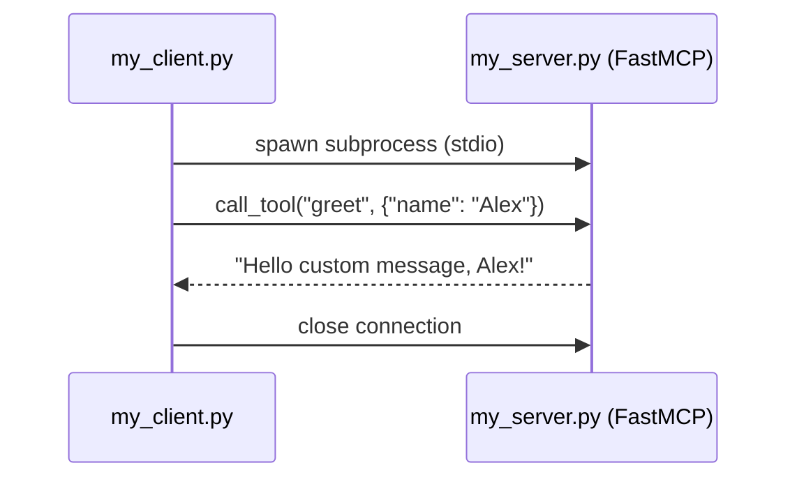
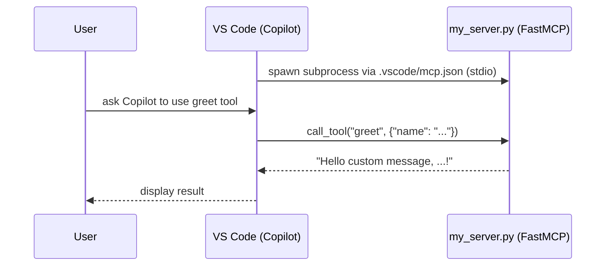

 co * Setup

```bash
uv python install 3.10        # Install Python 3.10
uv init --python 3.10         # Initialize project with Python 3.10
uv add fastmcp                 # Add fastmcp dependency
uv sync                        # Sync dependencies
source .venv/bin/activate      # Activate virtual environment
```

* Instrument client and server WITHOUT MCP host

```bash
# start the server
uv run my_server.py
fastmcp run my_server.py:mcp

# start the client
uv run my_client.py
```

* Without an MCP host, creating the client



* With VS Code as MCP Host



---

### MCP vs FastMCP


* MCP is the official Python SDK

```bash
pip install mcp[cli]
# install the core library + the mcp CLI
uv add "mcp[cli]"

# launch server
mcp run <server_name.py>

# launch inspector
mcp dev <server_name.py>

# install a server
mcp install
``` 
* FastMCP is a high-level Python framework built on the of MCP SKD

```bash
uv add fastmcp
```
```python
from fastmcp import FastMCP
mcp = FastMCP("MyMCP")
```
```bash
# launch server
fastmcp run my_server.py:mcp

# launch inspector
fastmcp dev inspector my_server.py --host <host> --port <port>
``` 